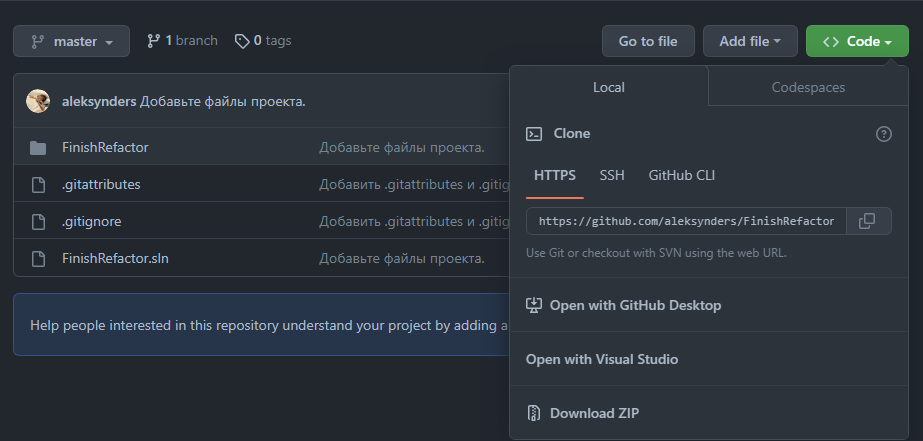
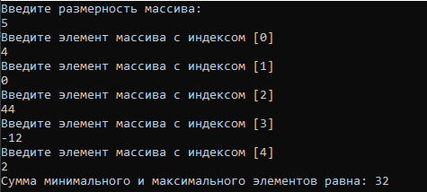

# Произведение максимального и минимального элементов массива
**Программа** позволяет произвести умножение максимального элемента массива на минимальный элемент.
## ⭕ Установка
Для начала работы необходимо установить программу по [*данному репозиторию*](https://github.com/aleksynders/FinishRefactor). После скачивания архива с файлами программы
необходимо распаковать его в удобный Вам каталог.
После извлечения файлов нужно перейти в папку с распакованным архивом и открыть файл "FinishRefactor.sln". Если будет предложен выбор приложения -
выберите Microsoft Visual Studio.
После запуска Visual Studio запустите программу с помощью горячей клавиши F5. Далее необходимо следовать инструкциям, которые даёт программа.



### Условия для установки
Для того чтобы использовать программу необходимо следующее:
* ОC Windows 7, 8, 10, 11
* 74КБ свободного пространства на диске
* MS Visual Studio

## ⚙ Пример работы
1. Запустите программу.
2. Введите размерность массива (Учтите, что существует минимальная и максимальная размерность).
```C#
int sizeArray;
while (true) // Ввод размерности массива
{
    Console.WriteLine("Введите размерность массива: ");
    while (!int.TryParse(Console.ReadLine(), out sizeArray))
    {
        Console.WriteLine("Введено не верное значение, попробуйте повторить ввод!");
    }
    if (sizeArray <= 1 || sizeArray >= 2147483645)
        Console.WriteLine("Введено не верное значение, попробуйте повторить ввод!");
    else break;
}
```
3. Введите элементы массива (Элементы могут быть только целочисленными!).
```C#
while (!int.TryParse(Console.ReadLine(), out tNum))
{
    Console.WriteLine("Введено не верное значение попробуйте повторить ввод");
}
```
4. Получите результат.



## ❤ Поддержка
[**VK**](https://vk.com/aleksynders)

[**Telegram**](https://t.me/aleksynders)

